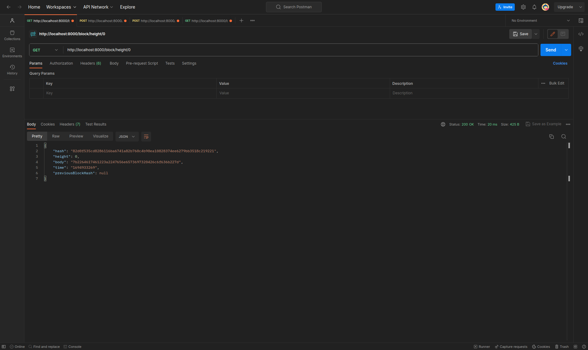
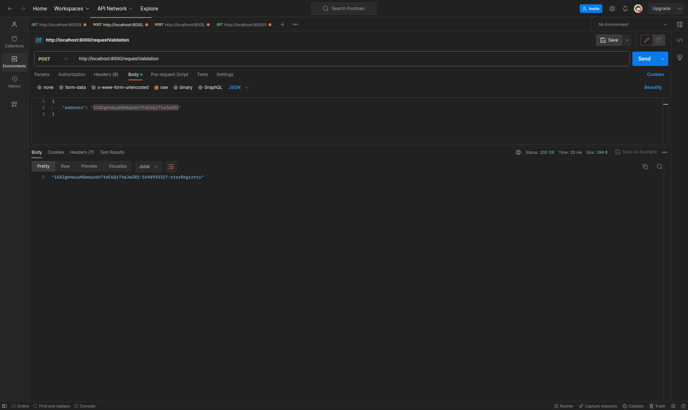
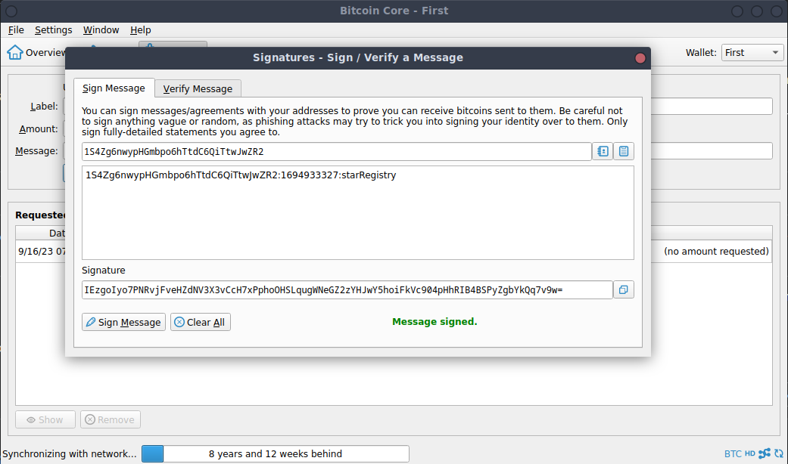
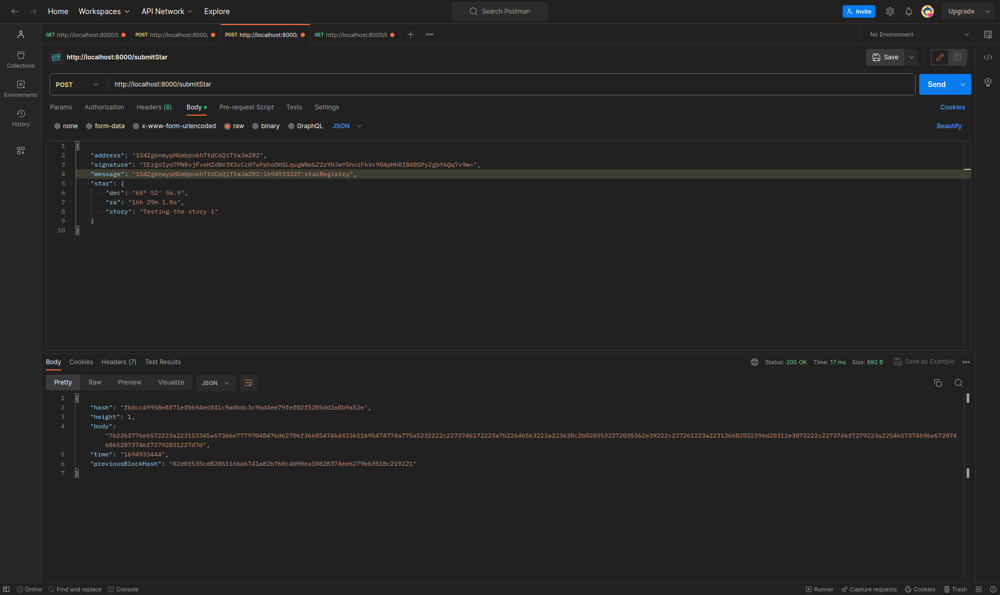
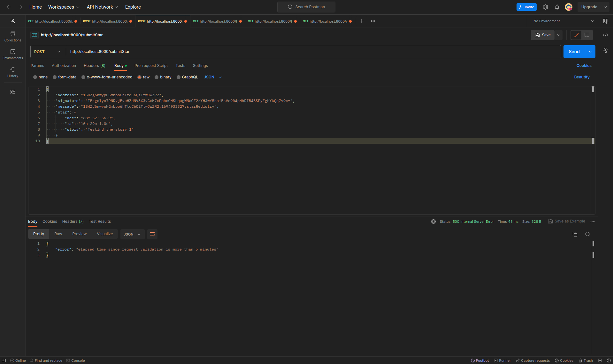
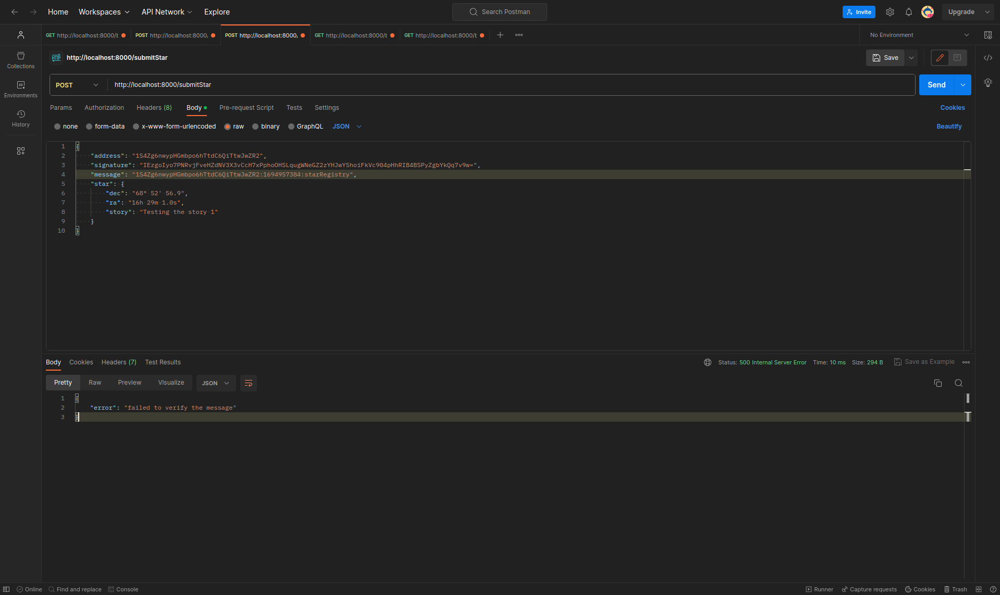
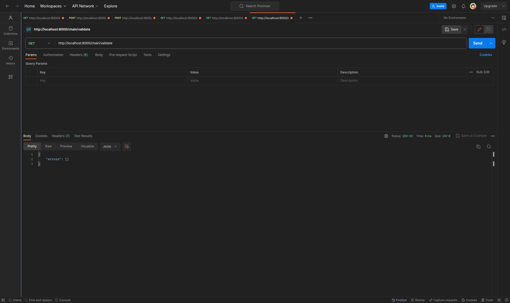

# Udacity | Blockchain Developer nano-degree | Project 1 | Private Blockchain Application

> The app was tested with `NodeJS v18.13.0` and `npm v9.2.0`

The following sections depict the results of the requested tests:

### Retrieve the genesis block
> `Request: http://localhost:8000/block/height/0`

### Request validation
> `Request: http://localhost:8000/requestValidation`

### Sign message with wallet

### Submit star
> `Request: http://localhost:8000/submitStar`

#### Successful request

#### Failed request: elapsed time more than 5 minutes

#### Failed request: not veriafiable message

### Retrieve stars owned by a particular address
> `Request: http://localhost:8000/blocks/1S4Zg6nwypHGmbpo6hTtdC6QiTtwJwZR2`

### Validate blockchain
> `Request: http://localhost:8000/chain/validate`

